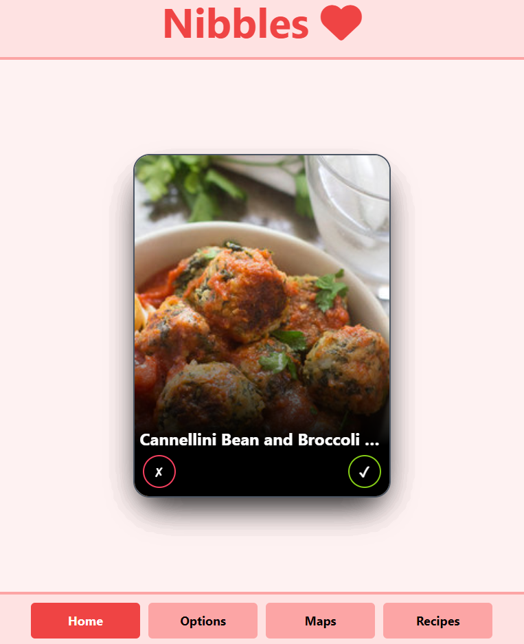

# Nibbles ❤️

# Overview

Nibbles is a application that allows users to find delicious recipes in a Tinder style and also find what restaurants available around their location

# Techstack

## Languages

- HTML
- CSS
- JavaScript

## API

- EDAMAM API
- Google Places API

# links

## The URL of the deployed application

- https://rouge86.github.io/Nibbles/

## The URL of the GitHub repository

- https://github.com/rouge86/Nibbles
